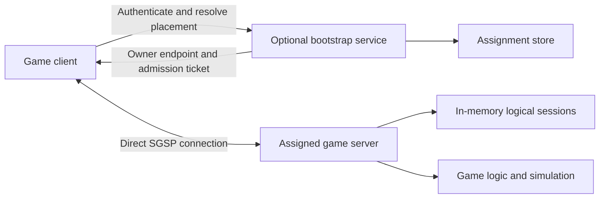
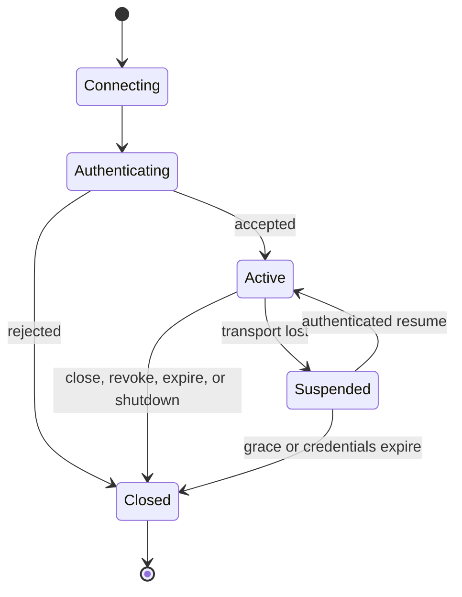

# SGSP — Simple Game Server Protocol

Status: version 1 design and implementation contract. The Go implementation
and its milestone evidence live in this repository; M8 release evidence is
still incomplete until a qualifying reference-host capacity and impairment
campaign is retained. See `docs/milestones/` for executed evidence and open
gates.

Audience: game developers, library implementers, and operators. [ARCHITECTURE.md](ARCHITECTURE.md) is the normative implementation contract and verification handoff.

## 1. Purpose

SGSP is a Go client/server networking library and a language-neutral application protocol for communication between a game and its authoritative game server. Its purpose is to make networking convenient without prescribing the game's simulation, data model, or message vocabulary.

The first release targets native clients and competitive action games at 60–128 updates per second. It provides dependable messages for commands and results, disposable updates for time-sensitive state, and custom streams for application-defined communication. Both endpoints can initiate communication.

### Requirements

| ID | Requirement | Success condition |
| --- | --- | --- |
| R1 | Convenient Go APIs | Client and server use the same session messaging interface; typed helpers are optional. |
| R2 | Flexible communication | Events, requests, raw payloads, and custom byte streams are available in both directions. |
| R3 | Reliable and unreliable delivery | The application explicitly chooses delivery semantics; unsupported semantics fail visibly. |
| R4 | Sticky logical sessions | A connection loss can be resumed on the original server with the same session identity. |
| R5 | Match/room affinity | Concurrent joins for a group converge on one recorded server owner. |
| R6 | Client authentication | Gameplay handlers cannot run before authentication; refresh and revocation are supported. |
| R7 | Bounded resource use | Queue, message, stream, request, and admission limits prevent unchecked accumulation. |
| R8 | Competitive-game performance | Reproducible 60/128 Hz measurements establish a supported operating capacity. |
| R9 | Simple deployment | A single server needs no bootstrap service, HTTP API, or database. |
| R10 | Implementable specification | Wire examples, lifecycle rules, API ownership rules, and test gates agree. |

Game code owns simulation, tick scheduling, matchmaking policy, permissions, persistence, interest management, interpolation, prediction, and reconnect reconciliation. Group affinity is placement; it does not implement room membership or broadcast subscriptions.

Version 1 delivers Go client and server SDKs. Browser SDKs, Godot/C# bindings, a built-in account database, cross-server session recovery, and automatic game-state replication are future work.

## 2. System architecture



The core library handles transport, framing, authentication lifecycle, dispatch, and session continuity. Optional packages provide placement and token verification. External storage and identity systems are integrations rather than mandatory dependencies of every game server.

### Direct and assigned connections

A single-server game directly dials a known server endpoint. The game server authenticates the client and creates a session.

In a multi-server deployment, an optional bootstrap service authenticates the client, obtains an assignment, and returns the specific owner's endpoint with a short-lived admission ticket. The client then opens its gameplay connection directly to that owner. Bootstrap requests themselves use SGSP; REST is unnecessary.

The bootstrap service is outside the gameplay traffic path. Existing gameplay and direct reconnects continue if bootstrap or its assignment store is temporarily unavailable.

Owner endpoints must route to a specific game-server process. Randomly balancing a saved reconnect address among several game servers breaks the ownership contract. Every process receives a fresh incarnation identifier, including when it restarts with the same server name.

## 3. Transport choice

Use QUIC with TLS 1.3 and the QUIC DATAGRAM extension. The initial Go adapter uses `quic-go`; the application's public API does not expose its concrete types. QUIC provides multiplexed reliable streams; DATAGRAM adds unreliable messages under the same encrypted, congestion-controlled connection. [QUIC](https://www.rfc-editor.org/rfc/rfc9000.html), [QUIC DATAGRAM](https://www.rfc-editor.org/rfc/rfc9221.html)

| Application traffic | SGSP mapping | Guarantee |
| --- | --- | --- |
| Authentication and session control | Dedicated bidirectional control stream | Reliable, ordered control messages |
| Reliable events | One unidirectional stream per sending channel | Ordered within that channel and direction |
| Request/reply | One bidirectional stream per request | Independent exchange, with cancellation |
| Unreliable events | QUIC datagrams | Loss and reordering are permitted |
| Sequenced unreliable events | QUIC datagrams with sequence numbers | Older updates and duplicates are discarded per channel |
| Custom streaming | Dedicated bidirectional byte stream | Application-defined reliable streaming |

Independent streams avoid a single stream's ordering dependency across unrelated channels. Connection bandwidth and congestion control remain shared; SGSP does not promise strict network priority or isolation from bandwidth exhaustion.

Sequenced unreliable channels are useful for replaceable state, such as a complete current input sample. Their ordering scope is the entire channel, not an individual entity. Applications that pack unrelated entities onto one channel must provide their own sequencing or send self-contained snapshots. The implementation coalesces unsent and undispatched sequenced updates per channel to avoid accumulating obsolete work.

Native QUIC requires reachable UDP endpoints. Version 1 explicitly reports an unavailable transport or capability. It does not silently turn unreliable messages into reliable messages. Browser access would require a later compatible transport adapter and SDK.

### Why this choice

WebSocket/TCP would simplify some integrations but would not provide unreliable delivery. A UDP reliability and security layer would add protocol implementation work that existing QUIC stacks already perform. QUIC is the selected v1 transport because the required communication modes fit its capabilities. Its actual performance remains a measurement requirement.

## 4. Developer experience

### Sessions and messages

A `Session` represents a logical authenticated peer. It exposes `Send`, `TrySend`, `Call`, `OpenStream`, `RefreshAuth`, and `Close`, together with identity, lifecycle state, and connection epoch. The same operations are available to client and server code.

Messages have application-assigned numeric types and opaque payloads. SGSP does not require resources, URLs, remote object models, or code generation. Optional `Message[T]`, `Request[Input, Output]`, and `Codec[T]` helpers associate types with codecs.

The following is an illustrative API-use fragment; application types, codecs, and connection setup are supplied by the game:

```go
inputs := sgsp.Message[Input]{
    ID:    10,
    Codec: inputCodec,
}

err := sgsp.Emit(ctx, session, inputs, input, sgsp.SendOptions{
    Channel:  1,
    Delivery: sgsp.UnreliableSequenced,
})
if err != nil {
    return err
}

inventory, err := sgsp.Call(ctx, session, inventoryRequest, query)
```

Provide a JSON codec for development. Applications can supply compact binary or other codecs through the same interface. Custom streams support data that does not fit the message API.

### Dispatch

An endpoint chooses handlers or polling when configured. Handler mode serializes ordinary messages per session; different sessions can progress concurrently. Polling mode lets the game control delivery at a tick boundary. Control messages and incoming replies are processed independently of application callbacks.

For competitive simulation, the recommended integration is to enqueue authenticated commands into the simulation's own bounded inbox. Attach the session ID and connection epoch to queued commands. Check the epoch again when applying them so an old connection cannot inject delayed work after a resume.

An SGSP game-loop integration does not automatically make commands idempotent or deterministic. Those remain properties of the game's command processing.

### What success means

Successful `Send` means that the library accepted the payload locally. Successful unreliable sends can still be lost. A dependable application acknowledgment requires an explicit reply.

`TrySend` returns immediately when the local queue is full. `Send` can wait for capacity until its context expires. Normal send APIs copy accepted payloads before returning, allowing the caller to reuse its memory.

A request that times out or loses its connection may already have executed remotely. SGSP reports an unknown outcome where appropriate and does not replay it. The game supplies operation IDs and deduplication for safe retries.

## 5. Sessions and group ownership



### Reconnecting

An owner retains a disconnected session for 30 seconds after detecting transport loss, unless authentication expires sooner. The client saves the session ID, owner endpoint, process incarnation, and opaque resume secret.

A reconnect presents fresh authentication and the resume secret to that owner. A successful resume preserves session identity and the game's session attachment, advances the connection epoch, and supersedes the previous transport. The previous transport's readers, streams, and queued messages cannot become current again.

Pending requests fail, custom streams end, and transport queues are discarded on disconnection. Sending while suspended returns an explicit error. The game receives a resume lifecycle event and supplies a fresh snapshot or another reconciliation mechanism.

Failed authentication does not evict an existing valid connection. Lost resume-acceptance responses can be retried using the existing resume secret. One client-side reconnect loop performs exponential backoff with jitter.

An owner crash or restart ends its sessions. A new game session can be created elsewhere through the game's normal matchmaking flow. SGSP does not present that new session as a continuation of the lost one.

### Group affinity

A group key identifies one match or room instance. The assignment store atomically creates a group-to-owner record. Simultaneous joins return the existing winner even when callers propose different owners.

Health changes can prevent new admissions but cannot reassign an existing group. Closing a group records a terminal assignment; a replacement match uses a new key. The application decides when a group closes. An empty room does not automatically release its assignment.

The development store is in memory. The optional PostgreSQL adapter persists assignments and supports multiple bootstrap processes. An admission ticket binds the identity, application, group, owner, and expiration; knowing a group key does not authorize joining it.

## 6. Authentication and security boundaries

An application-supplied authenticator turns a credential into a principal with an issuer, subject, expiration, and attributes. Authentication is required before game dispatch. Anonymous games must configure an explicit anonymous authenticator.

The signed-token helper verifies trusted keys, signatures, permitted algorithms, issuer, audience, and time claims. Identity credentials and placement tickets have distinct token types and validation rules. [JWT best current practices](https://www.rfc-editor.org/rfc/rfc8725.html)

Clients validate the server's TLS identity before sending credentials. Application 0-RTT is disabled because early data can be replayed. [QUIC TLS replay considerations](https://www.rfc-editor.org/rfc/rfc9001.html#section-9.2)

Identity verification, permission to join a group, and permission to perform a game action are separate checks. SGSP calls the relevant hooks but does not invent the game's permission model.

Active sessions can refresh credentials in-band for the same issuer and subject. An unrefreshed expiration closes the session. The host can revoke a principal immediately. Resume secrets are random 256-bit credentials, stored as hashes at the owner and excluded from logs.

## 7. Limits and performance

These are configurable starting defaults, not measured performance results. [ARCHITECTURE.md](ARCHITECTURE.md) defines enforcement and the additional aggregate limits.

| Setting | Default |
| --- | --- |
| Reconnect grace | 30 seconds after transport-loss detection |
| Authentication timeout | 5 seconds |
| Keepalive / transport idle timeout | 1 second / 5 seconds |
| Control message maximum | 16 KiB |
| Reliable message maximum | 64 KiB; larger transfers use streams |
| Encoded SGSP datagram maximum | 1,000 bytes, subject to the transport's smaller current limit |
| Application queue per direction | 256 KiB or 256 messages, whichever fills first |
| Reliable event channels per direction | 16 |
| Concurrent requests / custom streams per peer and initiator | 32 / 8 |
| Application 0-RTT / automatic request replay | Disabled |

Bounded parsing, queues, pending operations, and connection admission are required. Reliable pressure pauses reading; unreliable pressure discards messages. Control traffic has reserved application capacity. A slow consumer eventually receives an explicit closure rather than causing indefinite buffering.

Datagrams are not fragmented by SGSP. Their size must fit the current transport limit, including SGSP framing, and that limit can change. Oversized sends produce a structured size error. [quic-go datagram API](https://pkg.go.dev/github.com/quic-go/quic-go@v0.62.0#Conn.SendDatagram)

The implementation avoids a global gameplay lock, per-message goroutines, mandatory reflection, and automatic compression. Pooled internal buffers and a bounded dispatcher reduce allocation and scheduling pressure. Application-owned state and retained payload copies remain the application's memory responsibility.

The initial acceptance target is less than 1 ms p99 SGSP queue-and-dispatch overhead at the published healthy-network operating capacity. This excludes network transit and simulation tick waiting. It must be evaluated against the same workload running directly on QUIC, with hardware and dependency versions recorded.

The quic-go documentation identifies datagram throughput as an optimization area. The required 60/128 Hz benchmark campaign must finish before advertising capacity for competitive games. [Datagram performance notes](https://quic-go.net/docs/quic/datagrams/)

## 8. Operations and delivery

A draining server rejects new sessions while permitting its existing sessions to reconnect until the drain deadline. At the deadline, it explicitly closes remaining sessions. A bootstrap outage affects new assignment, and an owner outage affects that owner's sessions; neither event silently moves a live group.

Provide lifecycle events and bounded metrics for queue occupancy, queue age, authentication failures, active/suspended sessions, resume outcomes, request outcomes, datagram drops, frame errors, and transport statistics. Credentials, tickets, and resume secrets must never appear in diagnostic output. Session and player identifiers are log context rather than metric labels.

Version 1 completion requires:

1. Go SDKs and the normative wire specification with golden vectors.
2. Token helpers, placement interfaces, development store, and PostgreSQL adapter.
3. A reconnecting action-game example with typed and raw messaging.
4. Deterministic lifecycle and concurrency tests, race detection, fuzzing, and resource checks.
5. Reproducible loss/latency tests and capacity benchmark reports.

The implementation order, named tests, acceptance assertions, and commands are specified in [ARCHITECTURE.md](ARCHITECTURE.md). Documentation review does not satisfy any future implementation or performance gate.
